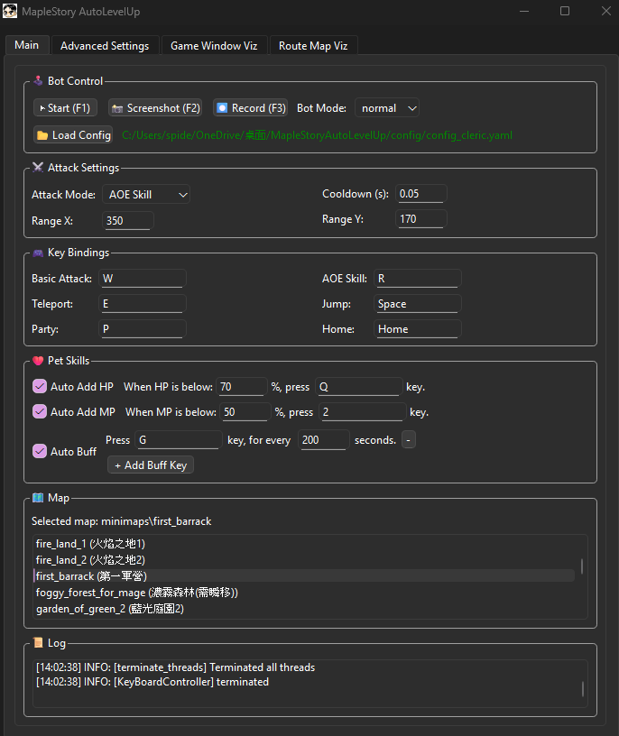
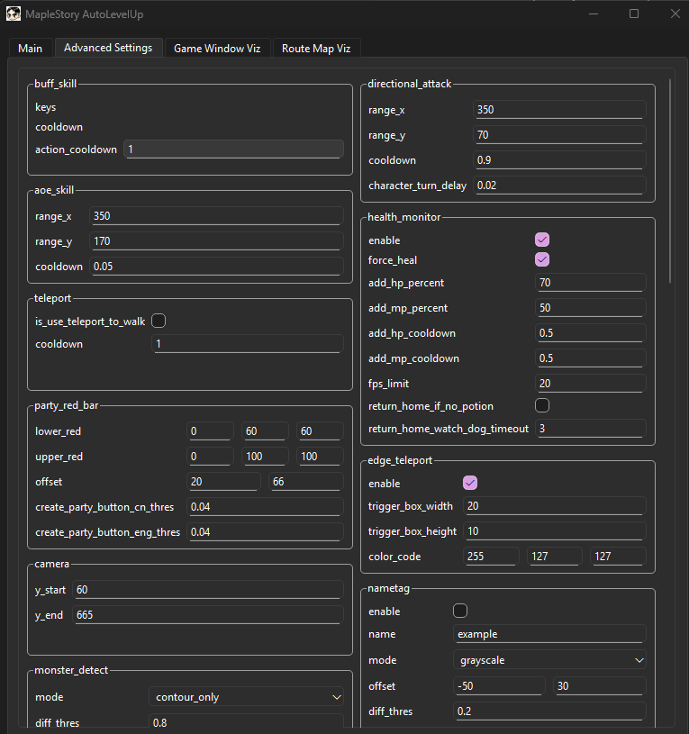

# Maple Story Auto Level Up

An auto leveling up bot for Maple Story Artale


[▶ Watch demo on YouTube](https://www.youtube.com/watch?v=QeEXLHO8KN4)

## Download
[](https://github.com/KenYu910645/MapleStoryAutoLevelUp/releases/latest)

📥 **[Download the latest version here](https://github.com/KenYu910645/MapleStoryAutoLevelUp/releases/latest)**

## Run on Windows
1. Run MapleStory World and make sure the game is on windowed mode and game window size is resized to smallest
2. Turn on minimap on the top-left corner in the game.
3. Create a party in the game(press 'P' and click 'build'), and make sure a red bar shows on top of your character
4. Navigate your character to map you want to farm
5. **[Download the latest release](https://github.com/KenYu910645/MapleStoryAutoLevelUp/releases/latest)**
6. Unzip the MapleStoryAutoLevelUp.zip and run MapleStoryAutoLevelUp.exe
7. Adjust configuration on main tab in the UI
8. press 'Start' button or 'F1' to start the script
9. Have fun!

## Features
This work purely-based on Computer Vision technique, it doesn't required access game's memory. Instead, it detects image pattern(i.e., player red health bar and mobs) on game window screen and send simulated keyboard command to the game to control player's character.

✅ No game's memory access required

✅ Purely Computer Vision

✅ Simulates real keyboard input

✅ User friendly UI
|  |  |
|:-------------------------------:|:-------------------------------------------:|
| Main Tab UI                    | Advanced Settings UI                        |

✅ Auto solve rune


✅ Visualization window for debugging

✅ Auto HP/MP potion drink

✅ Auto change channel

✅ Auto dice rolling for character creation

✅ Support global/taiwan Artale server

✅ Support English and Traditional Chinese Language

## Environment
* Windows11/MacOS
* Python3.12
* OpenCV4.11

Note: this project DOES NOT support virtual environment(VM), it's only for recreational and academical use.

## Supported MapleStory Version
This project is mostly developed and tested on MapleStory Artale Taiwan Server and Global Server

## Run(Only for Developers)

### Install dependency
```
pip install -r requirements.txt
```

### Run with UI (Recommend)
Run command
```
python -m src.main
```
Press 'F1' or 'start' button to start auto bot

Tune the configuration to suit your character

Note that the advanced settings is still work in progress.
If you need to change advanced configs, please modify config_default.yaml

### Run without UI
#### Run script
```
python -m src.engine.MapleStoryAutoLevelUp
```
#### Run with a custom config
```
python -m src.engine.MapleStoryAutoLevelUp --cfg my_config
```
#### Disable debug visualization window
```
python -m src.engine.MapleStoryAutoLevelUp --disable_viz
```
#### Record the debug window
```
python -m src.engine.MapleStoryAutoLevelUp --record
```
#### Choose map via config.yaml
Edit your map selection in the config file:
```
# In config/config_default.yaml
bot:
  map: ""  # Set the map name. See available maps in config/config_data.yaml
```
* Press 'F1' to pause/continue the script control
* Press 'F2' to take a screenshot, which will be saved to screenshot/
* Press 'F12' to terminate script

## Supported Map
Please refer to config/config_data.yaml

## Want to Make a New Map? → Route Recorder

To design a custom route map, you can use the `routeRecorder.py` script.
It listens to your keyboard inputs and records them onto a route map.

Use the following command in your terminal to start recording:

```
python -m tools.routeRecorder --new_map <map_directory_name>
```
| Key  | Action                                     |
| ---- | ------------------------------------------ |
| `F1` | Pause or resume the recorder               |
| `F2` | Take a screenshot (saved to `screenshot/`) |
| `F3` | Save current route map and start a new one |
| `F4` | Save the current map to map.png            |

* Please register mobs in config/config_data.yaml after creating a new map. 
* If this is a big map, it's recommended to scan the map first instead of start record route right away.
  Operate your character in the game and make sure you explore the whole map.
* Press 'F4' to update the current scanned map to debug window. If you are satisfied with current map, proceed to record route by pressing 'F3', it will refresh the whole route map.
* When recording route map, you can attack mobs on the way as the attack key won't be recorded.
* Typically, a raw record route map won't work very well. Use Paint tool to edit the route map, and fine tune the route

## Want to Make a New Monster? → Mob Maker

You can find the names of the monsters to be added at the following website:

[Maplestory GMS 65](https://maplestory.wiki/GMS/65/mob)

```
python tools/mob_maker.py

>Fetching mobs from: https://maplestory.io/api/GMS/65/mob
>You can find monster names at https://maplestory.wiki/GMS/65/mob
>Enter mob name:Snail  <-- Example
```

Automatically download monster PNG images, excluding death animation frames, since monsters do not need to be attacked again after death and therefore do not require recognition.

The monster actions such as `hit`, `move`, `skill`, and `stand` are retained. While it's uncertain whether keeping so many actions will affect performance, the expectation is that having a greater variety of monster animations will enhance the diversity and accuracy of monster recognition.

Once the download is complete, you can find the downloaded image in the `monster/{MonsterName}` folder.

## Auto Dice Roller
Auto Dice Roller help you roll the dice in character creation page.

User can assign the desire attributes and let the script do the job for you

```
python -m tools.AutoDiceRoller --attribute <STR,DEX,INT,LUK>

Example: for creating a full-INT wizard character:
python -m tools.AutoDiceRoller --attribute 4,4,13,4

Example: question mark is allowed if you don't want to assign a value
python -m tools.AutoDiceRoller --attribute 4,4,?,?
```
## Discord
Join our Discord server for more discussions

https://discord.gg/DqjtJGNEx7

## Legacy Version
This project previously use full-size screenshot map for camera localization
and route planning. However, I found that capturing player location from top-left corner minimap in the game is easier and more reliable.

Therefore, I developed a new localization scheme based on minimap, and all the previously maps/ are migrated to minimaps/ to benefit from this change. If you still want to use the old camera/player localization method. Please use the following command:

```
python -m src.legacy.mapleStoryAutoLevelUp_legacy.py --map <name_of_the_map> --monsters <name_of_the_monsters> --attack <skill>

Example:
python -m src.legacy.mapleStoryAutoLevelUp_legacy.py --map lost_time_1 --monsters evolved_ghost --attack aoe_skill
```

## ☕ Support the Developer

If you find this project helpful, consider supporting the developer by buying me a coffee!

> 💡 You can type in any amount you like — $1, $5, or $10 — whatever you're comfortable with.  
> 💵 Tips are in **USD**, not NTD.

[](https://www.buymeacoffee.com/kenyu910645)
