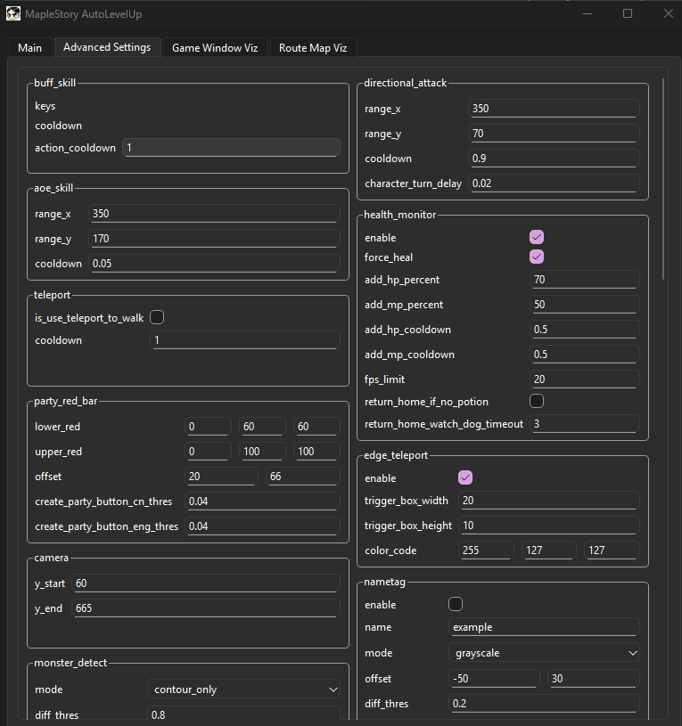

# MapleStory Artale 自動練等腳本

一款用於 Maple Story Artale 的自動練等腳本機器人


[▶ 在 YouTube 上觀看Demo](https://www.youtube.com/watch?v=QeEXLHO8KN4)

## 下載
[](https://github.com/KenYu910645/MapleStoryAutoLevelUp/releases/latest)

📥 **[點此下載最新版](https://github.com/KenYu910645/MapleStoryAutoLevelUp/releases/latest)**

## 執行方式
1. 執行 MapleStory World，並將遊戲設定為視窗模式，且視窗大小縮至最小
2. 開啟遊戲左上角的小地圖
3. 在遊戲中建立隊伍（按下 `P` 並點擊「建立」），確保遊戲角色上方出現紅色血條
4. 將角色移動到想要練功的地圖
5. **[下載最新版本](https://github.com/KenYu910645/MapleStoryAutoLevelUp/releases/latest)**
6. 解壓縮 MapleStoryAutoLevelUp.zip，執行 MapleStoryAutoLevelUp.exe
7. 在 UI 主頁面調整設定
8. 按下 `Start` 按鈕或 `F1` 鍵開始腳本
9. Enjoy!

## 功能介紹
本專案完全以電腦視覺技術實作，無需讀取遊戲記憶體。透過偵測遊戲畫面上的圖像（例如角色的紅色血條與怪物），並模擬鍵盤輸入來控制角色。

✅ 不需讀取遊戲記憶體

✅ 純電腦視覺實作

✅ 模擬真實鍵盤輸入

✅ 友善的使用者介面
|  |  |
|:-------------------------------:|:-------------------------------------------:|
| 主頁面 | 進階設定頁面 |

✅ 自動解符文


✅ 除錯視窗

✅ 自動喝 HP/MP 藥水

✅ 自動換頻道

✅ 角色建立自動擲骰

✅ 支援全球與台服 Artale 伺服器

✅ 支援英文與繁體中文

## 環境需求
* Windows11/MacOS
* Python3.12
* OpenCV4.11

注意：本專案不支援虛擬機環境，僅供娛樂與學術用途。

## 支援的 MapleStory 版本
本專案主要在 MapleStory Artale Taiwan與Global伺服器開發與測試。

## 執行方式（開發者用）

### 安裝依賴
```bash
pip install -r requirements.txt
```

### 建議使用 UI 執行
執行以下指令
```bash
python -m src.main
```
按下 `F1` 或 `start` 按鈕開始

調整設定以符合你的角色

進階設定仍在開發中，若需修改請編輯 config_default.yaml

### 不使用 UI 執行
#### 執行腳本
```bash
python -m src.engine.MapleStoryAutoLevelUp
```
#### 使用自訂設定檔
```bash
python -m src.engine.MapleStoryAutoLevelUp --cfg my_config
```
#### 關閉除錯視窗
```bash
python -m src.engine.MapleStoryAutoLevelUp --disable_viz
```
#### 錄製除錯視窗
```bash
python -m src.engine.MapleStoryAutoLevelUp --record
```
#### 透過 config.yaml 選擇地圖
在設定檔中修改：
```yaml
# 於 config/config_default.yaml
bot:
  map: ""  # 設定地圖名稱，可於 config/config_data.yaml 內查詢
```
* 按下 `F1` 暫停/繼續腳本
* 按下 `F2` 截圖，檔案會存於 screenshot/
* 按下 `F12` 結束腳本

## 支援地圖
請參考 config/config_data.yaml

## 想製作新地圖？→ Route Recorder

可使用 `routeRecorder.py` 來設計自訂路徑地圖。此工具會監聽鍵盤輸入並記錄成路徑圖。

在終端機輸入以下指令開始記錄：
```bash
python -m tools.routeRecorder --new_map <map_directory_name>
```
| 鍵位 | 功能 |
| ---- | ------------------------------------------ |
| `F1` | 暫停或繼續記錄 |
| `F2` | 截圖（儲存於 `screenshot/`） |
| `F3` | 儲存目前路徑並開始新的 |
| `F4` | 將目前地圖存為 map.png |

* 新地圖建立後，請至 config/config_data.yaml 登記怪物
* 若為大型地圖，建議先探索一次地圖再開始記錄路徑
* 按下 `F4` 更新目前掃描地圖至除錯視窗，若滿意即可按 `F3` 重新記錄路徑
* 記錄時可邊打怪，攻擊鍵不會被記錄
* 原始路徑通常效果不好，可利用繪圖軟體(Paint)微調

## 想新增怪物？→ Mob Maker

可於下列網站查詢要加入的怪物名稱：

[Maplestory GMS 65](https://maplestory.wiki/GMS/65/mob)

```bash
python tools/mob_maker.py

>Fetching mobs from: https://maplestory.io/api/GMS/65/mob
>You can find monster names at https://maplestory.wiki/GMS/65/mob
>Enter mob name:Snail
```
下載完成後的圖片會位於 `monster/{MonsterName}` 資料夾。

## 自動擲骰工具
在創角介面自動擲骰，可輸入想要的屬性值交由腳本完成

```bash
python -m tools.AutoDiceRoller --attribute <STR,DEX,INT,LUK>

# 例如建立全智法師角色：
python -m tools.AutoDiceRoller --attribute 4,4,13,4

# 亦可使用問號表示不指定數值
python -m tools.AutoDiceRoller --attribute 4,4,?,?
```
## Discord
歡迎加入 Discord 伺服器討論

https://discord.gg/DqjtJGNEx7

## 舊版本
此專案以前是透過全螢幕截圖來定位相機與規劃路徑，但後來發現直接從左上角小地圖取得位置更簡單可靠。因此重新設計了新的定位方式，並將所有 maps/ 遷移至 minimaps/。若仍想使用舊方法，請執行：
```bash
python -m src.legacy.mapleStoryAutoLevelUp_legacy.py --map <map> --monsters <monster> --attack <skill>

# 範例：
python -m src.legacy.mapleStoryAutoLevelUp_legacy.py --map lost_time_1 --monsters evolved_ghost --attack aoe_skill
```

## ☕ 贊助作者
若覺得本專案對你有幫助，歡迎請作者喝杯咖啡！

> 你可以自由輸入金額，$1、$5 或 $10 均可
> 提醒：贊助金額以 **美元** 計算

[](https://www.buymeacoffee.com/kenyu910645)
